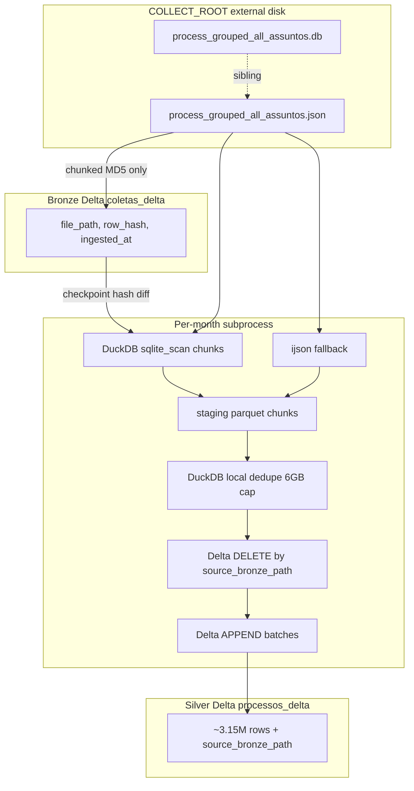

# Project source of truth — Habitual Tax Debtor Research

**Last updated:** 2026-07-07  
**Purpose:** Canonical description of this repository, its data lake, runtime environment, current operational state, and known challenges. When README and this document disagree, **this document wins** for architecture and ops state.

---

## 1. Mission

Build and maintain a **local data lake** for TJSP fiscal execution research (CEMEPI / gilson datasets): scrape or recoleta raw court data, land it in **bronze** Delta tables, transform into **silver** analytical tables, and analyze in Jupyter.

Primary incremental path: **`process_grouped_all_assuntos.json`** (bronze metadata) → silver **processos** (`processos_delta`), staging from sibling **`.db`** when present.

---

## 2. Runtime environment (current specs)


| Item                                     | Current value                                                                    |
| ---------------------------------------- | -------------------------------------------------------------------------------- |
| **Machine**                              | Apple Silicon MacBook (M1-class), macOS                                          |
| **Python**                               | 3.13 (`requires-python >= 3.13` in `pyproject.toml`)                             |
| **Package manager**                      | [uv](https://github.com/astral-sh/uv) (`uv sync`, `uv run`)                      |
| **Primary storage**                      | External volume `Meedi_Etore_HD1` (~932 GiB, APFS)                               |
| **Default `LAKE_ROOT` / `COLLECT_ROOT`** | `/Volumes/Meedi_Etore_HD1/CEMEPI/Coletas/gilson` (via `.env`)                    |
| **Repo path**                            | `pipelines/litigancia/` (inside monorepo `cemepi-ctf-intel-fiscal/`)      |
| **`.env` location**                       | Monorepo root (`cemepi-ctf-intel-fiscal/.env`), not under this pipeline   |
| **Overnight constraints**                | Unified RAM (~8 GiB), no cloud executor; jobs must survive sleep/OOM/USB latency |


**Implication:** Pipelines are tuned for **single-machine, external-disk, bounded RAM**. Throughput is often **I/O-bound** on the USB volume, not CPU-bound.

---

## 3. Technology stack

### Core data


| Layer          | Technology                         | Role                                                                 |
| -------------- | ---------------------------------- | -------------------------------------------------------------------- |
| Table format   | **Delta Lake** (`deltalake` ≥ 1.5) | Versioned bronze/silver tables on disk                               |
| Columnar IO    | **PyArrow** + **Parquet**          | Staging, chunked reads/writes                                        |
| SQL engine     | **DuckDB** ≥ 1.5                   | Per-run dedupe, global compact dedupe                                |
| DataFrames     | **pandas**, **polars** (available) | Bronze sqlite chunks, legacy paths                                   |
| JSON streaming | **ijson** ≥ 3.5                    | Silver fallback when sibling `.db` is missing |
| Per-month SQLite | **`process_grouped_all_assuntos.db`** | Silver staging via DuckDB `sqlite_scan` (primary for large months) |


### Collection


| Component       | Location                                                  | Notes                                          |
| --------------- | --------------------------------------------------------- | ---------------------------------------------- |
| **juscraper**   | Git dep `Etore-BeS/juscraper`                             | Playwright-based TJSP scraping                 |
| Recoleta driver | `scripts/processos/scraping/run_recollect_juscraper.py` | Config-driven; writes `coleta_fazenda_*` (round 1) or `coleta_assunto_*` (round 2+) under `COLLECT_ROOT` |
| Optional        | `src/scrapers/comunica_full.py`, `comunica_pje.py`        | Alternate collectors                           |
| Face pipeline   | `scripts/face/scraping/scrape_face_to_bronze.py`, `scripts/face/transforming/create_silver_face_layer.py` | Separate bronze/silver tables                  |


### Config & packaging

- **Paths:** `src/config/paths.py` (lake tables, `.env`)
- **Script paths:** `src/config/scripts.py` (canonical `scripts/` registry + dynamic loaders)
- **Wheel packages:** `src/config`, `src/scrapers`, `src/utils` (Hatch; no `__init__.py` per project convention)
- **Secrets:** `.env` at **monorepo root** (gitignored), optional `config/oxylabs.json`, AWS vars for Comunica S3

### LLM & agents (mandatory)

**Rule:** Every interaction with external LLM APIs or agent runtimes in this repository **must** go through **[pydantic-ai](https://ai.pydantic.dev/)** — no direct calls to provider SDKs (`openai`, `anthropic`, etc.) in application or notebook code.

| Requirement | Implementation |
| ----------- | -------------- |
| Framework | `pydantic-ai-slim[anthropic]` (see `pyproject.toml`) |
| Structured output | Pydantic `BaseModel` as `Agent(..., output_type=...)` |
| Provider access | `Agent('anthropic:model-name')` or explicit `AnthropicModel` |
| Business logic | `src/utils/` modules (e.g. `bibliometric_screening.py`) |
| Exceptions | Local Hugging Face / `transformers` inference (e.g. LegalBERT NER) — not chat/completion APIs |

**Rationale:** Single abstraction for retries, validation, provider switching, and testability. Provider SDKs may appear only as transitive dependencies of pydantic-ai.

**Current usage:** Bibliometric screening (`notebooks/articles/revisao-bibliometrica-2026/`) — `build_screening_agent()` + `ScreeningDecision`.

---

## 4. Repository layout

```
pipelines/litigancia/
├── docs/
│   └── SOURCE_OF_TRUTH.md    ← this file
├── logs/                             ← operational logs (not git-tracked by default)
│   ├── overnight.log                 ← run_new_data_to_silver runs
│   ├── compact-*.log                 ← global silver dedupe runs
│   └── compact-latest.log            ← symlink to latest compact log
├── scripts/
│   ├── processos/                    ← ingest orchestrators, audit, bronze/silver transforms
│   │   ├── run_new_data_to_silver.py
│   │   ├── run_one_json_to_silver.py
│   │   ├── audit_process_counts.py
│   │   ├── transforming/             ← create_bronze/silver, compact, backfill
│   │   └── scraping/                 ← recoleta driver
│   ├── face/
│   │   ├── scraping/                 ← scrape_face_to_bronze
│   │   └── transforming/             ← create_silver_face_layer
│   ├── movimentacoes/
│   │   ├── export_normalization_review.py
│   │   └── transforming/             ← create_silver_movimentacoes
│   ├── maintenance/                  ← optimize, explore_quality, export_validation_samples
│   │   └── other/                    ← fix_state
│   ├── ops/                          ← overnight run/start wrappers + lib/common.sh
│   └── data/                         ← recollect_dates.json, state, logs
├── src/
│   ├── config/paths.py               ← lake paths (.env)
│   ├── config/scripts.py             ← canonical script paths + loaders
│   ├── scrapers/
│   └── utils/
├── notebooks/
│   ├── data_paper/
│   ├── articles/
│   └── playground/
│       ├── eda_gilson.ipynb
│       └── extract_base_sent_victor.ipynb
├── pyproject.toml
└── README.md                         ← quickstart (points here for full state)
```

### 4.1 Script registry (`src/config/scripts.py`)

Canonical paths for scripts live in **`config.scripts`** (importable from any `uv run` context). Use these in Python loaders, error messages, and docs — avoid duplicating `scripts/...` strings.

| Symbol | Role |
| --- | --- |
| `RUN_NEW_DATA_TO_SILVER` | Incremental bronze→silver orchestrator |
| `RUN_ONE_JSON_TO_SILVER` | Single JSON subprocess entry |
| `CREATE_SILVER_LAYER` | Silver processos pipeline |
| `CREATE_SILVER_FACE_LAYER` / `CREATE_SILVER_MOVIMENTACOES` | Face / movimentações silver |
| `COMPACT_SILVER_PROCESSOS` | Global dedupe on processos |
| `BACKFILL_SILVER_SOURCE_PATHS` | Legacy `source_bronze_path` backfill |
| `SCRAPE_FACE_TO_BRONZE` | FACE scrape → bronze |
| `RUN_RECOLLECT_JUSCRAPER` | Recoleta driver |
| `AUDIT_PROCESS_COUNTS` | Canonical process count audit |
| `EXPORT_NORMALIZATION_REVIEW` | Manual review CSV export |
| `EXPORT_VALIDATION_SAMPLES` | PF/CNPJ validation samples |

Helpers: `load_transform_module(name)`, `format_command(path, *args)` for stable CLI strings in docs and stderr.

Overnight wrappers source [`scripts/ops/lib/common.sh`](../scripts/ops/lib/common.sh) for `REPO_ROOT`, logging, and `htdr_uv_python`.


---

## 5. Data architecture

### Path variables (`src/config/paths.py`)


| Symbol                                                       | Path (under `LAKE_ROOT` unless noted)                                 |
| ------------------------------------------------------------ | --------------------------------------------------------------------- |
| `COLLECT_ROOT`                                               | Raw recoleta: `coleta_fazenda_*` / `coleta_assunto_*` → `process_grouped_all_assuntos.json` |
| `BRONZE_COLETAS`                                             | `bronze_layer/coletas_delta`                                          |
| `SILVER_PROCESSOS`                                           | `silver_layer/processos_delta`                                        |
| `CHECKPOINT`                                                 | `silver_layer/.silver_bronze_paths.json`                              |
| `TMP_STAGE_DIR`                                              | `silver_layer/.tmp_staging`                                           |
| `AGGREGATED_DB`                                              | `aggregated_database.db` (sqlite bronze source, optional)             |
| `BRONZE_FACE` / `SILVER_FACE_CLEAN` / `SILVER_MOVIMENTACOES` | Face & movimentações pipelines (out of main recoleta path)            |


### Logical flow (processos — Tier B + SQLite staging)




### Bronze (collector JSON)

- **One logical row per collector file** (`file_path`).
- **Upsert:** `DeltaTable.delete(file_path)` + `append` (no full-table MERGE).
- **Metadata only:** no `raw_data` in new ingests; silver reads collector data from disk (`.db` preferred).
- **Pending detection:** MD5 of file vs latest `row_hash` in bronze (`find_pending_json_files`).
- **Subprocess ingest:** `ingest_json_file` uses single-path hash lookup (no full bronze table load).

### Silver (processos)

- **Staging source priority:** sibling `process_grouped_all_assuntos.db` (table `processos_comunicacoes_consolidado`) via DuckDB chunked `sqlite_scan`; else ijson on JSON path.
- **Staging output:** tag `source_bronze_path` (canonical JSON path); flush every `ITEM_FLUSH_THRESHOLD` (10_000) rows to parquet.
- **Dedupe (per run):** DuckDB `ROW_NUMBER()` on `(id_processo, decisao)` with `memory_limit=6GB` and spill under `.tmp_staging/duckdb_lake_temp`.
- **Schema:** `ensure_silver_source_column()` adds nullable `source_bronze_path` via Delta `alter.add_columns` when missing.
- **Publish (default):** DELETE rows where `source_bronze_path` = path, then APPEND deduped chunks (`PUBLISH_BATCH_ROWS` = 10_000). Delta `compact()` is **off** unless `--compact`.
- **Legacy:** `--legacy-merge` full-table MERGE (emergency only; stderr warning if silver has rows).
- **Checkpoint:** `merged_hashes` maps `file_path` → `row_hash` after successful publish; updated only at end of successful run.
- **Backfill:** `backfill_silver_source_paths.py` sets `source_bronze_path` on legacy NULL rows using `coleta_fazenda_*` / `coleta_assunto_*` folder ranges and/or **`--drive-download-only`** (sibling `.db` min/max `data_disponibilizacao` via DuckDB `strptime`; not SQLite text MIN/MAX). Silver dates: `DD/MM/YYYY`.
- **Preflight:** `--stage-only` stages + dedupes without touching silver (large-month validation).

### Global compact (optional)

- **Script:** `compact_silver_processos.py` / `compact_silver_global_dedupe()`.
- **Phases:** (1) shard all silver parquet into 128 hash buckets, (2) dedupe per bucket, (3) overwrite/append silver.
- **Test mode:** `--test` — 2 parquet files, 1% sample, no rewrite (~seconds–minutes).

---

## 6. Orchestration & CLI

### Main incremental pipeline

```bash
uv run python scripts/processos/run_new_data_to_silver.py --skip-sqlite
uv run python scripts/processos/run_new_data_to_silver.py --dry-run --skip-sqlite
```


| Flag                              | Effect                                                                          |
| --------------------------------- | ------------------------------------------------------------------------------- |
| Default                           | Phase 1 bronze-only (small→large), phase 2 silver-only; **subprocess per JSON** |
| `--max-items N`                   | Cap silver paths per run                                                        |
| `--bronze-only` / `--silver-only` | Split phases                                                                    |
| `--batch`                         | All bronze then all silver (high RAM)                                           |
| `--in-process`                    | Debug: no subprocess isolation                                                  |


Single file:

```bash
uv run python scripts/processos/run_one_json_to_silver.py <path/to/process_grouped_all_assuntos.json> [--bronze-only|--silver-only]
```

### Silver / checkpoint utilities

```bash
uv run python scripts/processos/transforming/create_silver_layer.py --ensure-schema
uv run python scripts/processos/transforming/backfill_silver_source_paths.py --dry-run
uv run python scripts/processos/transforming/backfill_silver_source_paths.py
uv run python scripts/processos/transforming/backfill_silver_source_paths.py --drive-download-only --dry-run
uv run python scripts/processos/transforming/backfill_silver_source_paths.py --drive-download-only
uv run python scripts/processos/transforming/create_silver_layer.py --show-pending
uv run python scripts/processos/transforming/create_silver_layer.py --only-new-paths
uv run python scripts/processos/transforming/create_silver_layer.py --path "<json>" --stage-only
uv run python scripts/processos/transforming/create_silver_layer.py --bootstrap-checkpoint --exclude-ingested-within-hours 72
```

`run_one_json_to_silver.py` defaults to **no** Delta compact; pass `--compact` to enable after publish.

### Process count audit (canonical metrics)

```bash
uv run python scripts/processos/audit_process_counts.py
uv run python scripts/processos/audit_process_counts.py --json-out logs/audit_process_counts.json
uv run python scripts/processos/audit_process_counts.py --skip-overlap   # faster; skips cross-month overlap scan
```

Use this instead of `COUNT(*)` on `coletas_delta` when reporting collected process volume.

### Delta lake optimize (Parquet compaction)

```bash
# Inspect fragmentation (active vs orphan files on disk):
uv run python scripts/maintenance/optimize_delta_lake.py --dry-run

# Smoke test (bronze coletas_delta only):
uv run python scripts/maintenance/optimize_delta_lake.py --test

# Full datalake overnight (compact + z-order + vacuum):
./scripts/ops/start_overnight_optimize.sh
tail -f logs/optimize-delta-latest.log
```

Do **not** run while ingest/face scrape jobs are writing the same tables.

### Overnight compact (logged)

```bash
./scripts/ops/start_overnight_compact.sh --buckets 128 --compact
tail -f logs/compact-latest.log
```

### Normalization review (tipo_movimentacao / tipo_sentença)

Export frequency-ranked CSVs for manual dictionary building. Aggregation is OOM-safe (DuckDB over `delta_scan`; movimentações grouped by **first line** of text).

```bash
# bash / fish
uv run python scripts/movimentacoes/export_normalization_review.py
uv run python scripts/movimentacoes/export_normalization_review.py --round 1
uv run python scripts/movimentacoes/export_normalization_review.py --check-quality
```

Outputs: `notebooks/playground/output/manual_review_tipo_*.csv`, `normalization_review_stats.json`.

Docs: [docs/normalization/](normalization/) (schema, taxonomy, quality gates, ops cycle). Reviewer instructions: `.tmp/explicacao_revisao_manual.md` (copy for external reviewers).

---

## 7. Current data scale (measured 2026-06-25)


| Asset | Approximate scale |
| ----- | ----------------- |
| Collector JSON files on disk | **87** `process_grouped_all_assuntos.json` under `COLLECT_ROOT` |
| Collected processes (SUM `count` in JSONs) | **6,104,584** |
| Collected processes (SUM sibling `.db` rows) | **6,027,637** (1 JSON missing sibling `.db`) |
| Silver `processos_delta` rows (decisions) | **6,100,561** |
| Silver `processos_delta` unique `id_processo` | **5,812,126** |
| Bronze `coletas_delta` physical rows | **527,289** — **not** process count (see §7.1) |
| Bronze JSON paths (latest hash) | **87** (all disk JSONs ingested) |
| Silver pending for merge | **0** |
| Cross-month overlap (process in >1 source file) | **272,386** processes |

Silver schema: core columns above + nullable **`source_bronze_path`**; `data_disponibilizacao` stored as **`DD/MM/YYYY` text**. Each JSON folder typically has matching **`.csv`** and **`.db`**; pipeline uses **`.db`** for silver staging.

### 7.1 Canonical counting rules (do not confuse layers)

| Question | Correct metric | Wrong metric (common mistake) |
| -------- | -------------- | ----------------------------- |
| How many processes were collected/ingested? | `SUM(count)` in JSONs under `COLLECT_ROOT`, or sum of `COUNT(*)` in sibling `.db` files | `COUNT(*)` on `coletas_delta` |
| How many unique processes globally? | `COUNT(DISTINCT id_processo)` on `processos_delta` | `SUM(count)` in JSONs (monthly overlap inflates) |
| How many decision/analytical rows? | `COUNT(*)` on `processos_delta` | bronze row count or face table |
| How many processes have FACE enrichment? | `COUNT(*)` or `COUNT(DISTINCT cd_processo)` on `face_processos_clean_delta` (~5.8 M) | `processos_delta` |

**Bronze `coletas_delta` (modern path):** one **metadata** row per collector file (`file_path`, `row_hash`, `ingested_at`) — not one row per process. Silver reads data from disk (`.db` / JSON); bronze does not expand processes.

**Why `COUNT(*)` on bronze is ~527 k not ~6 M:** besides the 87 JSON rows, the table still holds legacy SQLite ingest rows (`aggregated_database.db`) with one `raw_data` row per process. That inflates physical row count without being the operational metric.

**Typical reconciliation (2026-06-25):**

- `SUM(json count)` − unique silver ≈ **292 k** → processes repeated across overlapping monthly coletas.
- `SUM(json count)` − silver rows ≈ **4 k** → silver grain is `(id_processo, decisao)`; can have more rows than unique processes per month.

Re-run audit: `uv run python scripts/processos/audit_process_counts.py` (see §6).

## 8. Operational state (as of 2026-06-05)

### 8.1 Pipeline code state

| Area | Status |
|------|--------|
| Silver staging | **SQLite-first** when sibling `.db` exists; ijson fallback |
| Local dedupe | DuckDB **6GB** cap + lake temp dir (staging + compact) |
| `source_bronze_path` | **`ensure_silver_source_column()`** + `backfill_silver_source_paths.py` (DD/MM/YYYY dates) |
| Orchestration | Per-file subprocess; compact **opt-in** (`--compact`) |
| Large-file preflight | `--stage-only` on `create_silver_layer.py` |

### 8.2 Last overnight ingest — `logs/overnight.log` (pre-fix baseline)

Historical run before SQLite staging / schema migration:


| Phase | Result |
|-------|--------|
| Queue | 20 bronze-pending + 6 silver-pending → **26 paths** |
| Bronze | **7 ingested**; many large files failed with `MallocStackLogging` only |
| Silver | Legacy MERGE killed mid-run on large months; Tier B failed on missing column + ijson `NaN` |
| Pending after run | **10** silver paths |

**Safe to rerun:** checkpoint only advances on full success.

### 8.3 Global compact — `logs/compact-20260603-212654.log`


| Field            | Value                                                          |
| ---------------- | -------------------------------------------------------------- |
| Started          | 2026-06-04T00:26:54Z                                           |
| Command          | `--buckets 128 --compact`                                      |
| Progress         | Stopped at **Phase 1/3 (shard)** — no Phase 2/3                |
| Process          | **Dead** (stale `logs/compact.pid`); **no `exit_code` in log** |
| Silver after run | **Unchanged** (still 3,157,154 rows)                           |


Likely causes: sleep/OOM during single full scan of ~90 GiB on USB, or DuckDB temp pressure (earlier single-pass dedupe hit **78 GiB** temp limit before bucketed redesign).

### 8.4 Smoke test

`compact_silver_processos.py --test` (2 parquet files, bucketed) completes in **~20s** — logic OK; full scale fails on infra, not on syntax.

---

## 9. Known challenges (prioritized)

### P0 — Resolved in code (run once on lake)

1. **`source_bronze_path` on silver** — run `create_silver_layer.py --ensure-schema`, then `backfill_silver_source_paths.py` (see §6). Required before Tier B publish on legacy table.
2. **ijson `NaN` on JSON** — mitigated by **SQLite staging** when `.db` exists (2019-10, 2025-10, 2021-11, etc.).

### P1 — Infrastructure

1. **External USB I/O** — full-table scans and Delta append batches run **~2–5× slower** than internal NVMe; overnight jobs exceed sleep/OOM window.
  **Mitigation:** `LAKE_ROOT` on internal SSD for runs; rsync to/archive after (see README / prior planning).
2. **macOS memory pressure** — subprocess per file helps **between** months; each publish/merge peak can still trigger **jetsam** (no Python traceback; `MallocStackLogging` / semaphore warnings).
3. **Silver table growth** — legacy MERGE cost rises with row count; Tier B delete+append per source avoids full-table merge **once `source_bronze_path` exists**.

### P2 — Operations

1. **Long feedback loop** — full compact/shard phase 1 can run **hours** before visible failure; use `--test` and `--dry-run` before overnight jobs.
2. **Checkpoint/bootstrap mistakes** — `--bootstrap-checkpoint` after new bronze without excluding recent paths marks paths done without silver merge.
3. **Staging debris** — `silver_layer/.tmp_staging` may accumulate `run_`* and `compact_*` dirs; safe to delete when no job is running.

---

## 10. Pipeline tunables (code constants)


| Constant                  | Value                                                                          | File                     |
| ------------------------- | ------------------------------------------------------------------------------ | ------------------------ |
| `ITEM_FLUSH_THRESHOLD`    | 10_000                                                                         | `create_silver_layer.py` |
| `PUBLISH_BATCH_ROWS`      | 10_000                                                                         | `create_silver_layer.py` |
| `DEFAULT_COMPACT_BUCKETS` | 64 (CLI often 128)                                                             | `create_silver_layer.py` |
| `JSON_SUFFIX`             | `process_grouped_all_assuntos.json`                                            | bronze/silver            |
| `DB_SUFFIX` / `SQLITE_ITEMS_TABLE` | `process_grouped_all_assuntos.db` / `processos_comunicacoes_consolidado` | `create_silver_layer.py` |
| DuckDB lake sessions      | `threads=2`, `memory_limit=6GB`, temp under `.tmp_staging/duckdb_lake_temp` | staging dedupe + global compact |


---

## 11. Relationship map (what depends on what)

```
recoleta (juscraper) → COLLECT_ROOT JSON files
                    ↓
create_bronze_layer / run_new_data_to_silver (bronze phase)
                    ↓
bronze coletas_delta (metadata + row_hash)
                    ↓
create_silver_layer / run_one_json_to_silver (reads .db or JSON under COLLECT_ROOT)
                    ↓
silver processos_delta + .silver_bronze_paths.json
                    ↓
notebooks (eda_gilson.ipynb) / optional compact_silver_processos

Independent: face + movimentações + sqlite bronze + comunica collectors
```

**Git repo** holds code + small config samples; **lake data lives on volume**, not in git.

---

## 12. Recommended next actions (ordered)

1. **`--ensure-schema`** on silver, then coleta **`backfill_silver_source_paths.py`**, then **`--drive-download-only`** for gilson `drive-download-*` batches without `coleta_fazenda_*` in the path.
2. **Large-month preflight:** `--stage-only` on e.g. `coleta_fazenda_01_05_2018_...` (expect log `Staging source: sqlite`).
3. **One-file E2E:** `run_one_json_to_silver.py` on that path (no `--legacy-merge`).
4. **Overnight ingest:** `run_new_data_to_silver.py --dry-run --skip-sqlite`, then `--skip-sqlite --max-items 1` (prefer internal `LAKE_ROOT` if available).
5. **Global compact** only after ingest stable: `./scripts/ops/start_overnight_compact.sh --buckets 128`.
6. **Do not delete** `processos_delta` unless intentionally rebuilding silver from scratch.

---

## 13. Log index


| Log                                  | Contents                                                       |
| ------------------------------------ | -------------------------------------------------------------- |
| `logs/overnight.log`                 | `run_new_data_to_silver.py` bronze/silver phases, tqdm, errors |
| `logs/compact-*.log`                 | Global dedupe shard/dedupe/rewrite                             |
| `logs/compact-latest.log`            | Symlink to latest compact                                      |
| `scripts/data/recollect_process.log` | Recoleta scraping                                              |


---

## 14. Document maintenance

Update this file when:

- `LAKE_ROOT` / hardware changes
- A overnight run completes (success or new failure mode)
- Schema or pipeline semantics change (bronze/silver/checkpoint)
- New tables or scripts become part of the primary path

Quickstart commands remain in **README.md**; operational truth and **current state** live here.