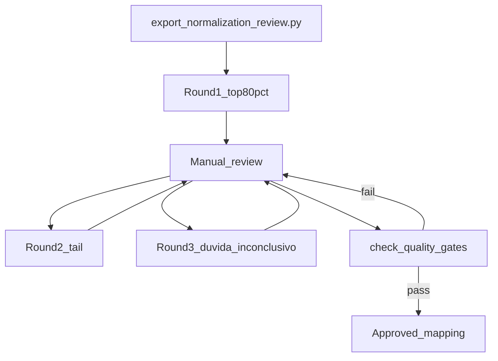

# Normalization ops cycle

> **Canonical commands:** [PROJECT_SOURCE_OF_TRUTH.md §6](../PROJECT_SOURCE_OF_TRUTH.md) (normalization review).

How to keep dictionaries current as new raw values appear in the lake.

## Cadence

| Trigger | Action |
|---|---|
| After major FACE/movimentações ingest | Re-export review CSVs with merge |
| Monthly (or before analysis sprint) | Re-export + compare stats JSON |
| New unmatched values in analysis | Ad-hoc review of tail rows |

## Workflow



## Round definitions

1. **Round 1** (`--round 1`): rows covering ~80% of frequency — highest impact first.
2. **Round 2** (`--round 2`): remaining `pendente` rows (long tail).
3. **Round 3** (`--round 3`): `duvida` and auto-`inconclusivo` rows for quality pass.

## Re-export without losing work

Default merge preserves manual edits on matching `valor_bruto`:

```bash
# bash
uv run python scripts/movimentacoes/export_normalization_review.py

# fish
uv run python scripts/movimentacoes/export_normalization_review.py
```

Fresh frequencies are refreshed; `normalizado_final`, outcomes, and audit columns are kept.

## Memory on large lakes

- Default DuckDB limit: `3GB` (`DUCKDB_MEMORY_LIMIT`).
- Process one table at a time (built into export script).
- If OOM persists, lower limit and ensure `/tmp` has space for spill:

```bash
# bash
DUCKDB_MEMORY_LIMIT=2GB DUCKDB_THREADS=1 uv run python scripts/movimentacoes/export_normalization_review.py

# fish
env DUCKDB_MEMORY_LIMIT=2GB DUCKDB_THREADS=1 uv run python scripts/movimentacoes/export_normalization_review.py
```

## Versioning approved mappings

After quality gates pass:

1. Filter rows with `status_revisao = aprovado`.
2. Save as versioned CSV under `config/normalization/` (e.g. `tipo_sentenca_v1.csv`).
3. Record stats JSON and date in commit message or analysis notebook.

New raw values appearing after export show up as new rows with `status_revisao = pendente` on next merge export.
